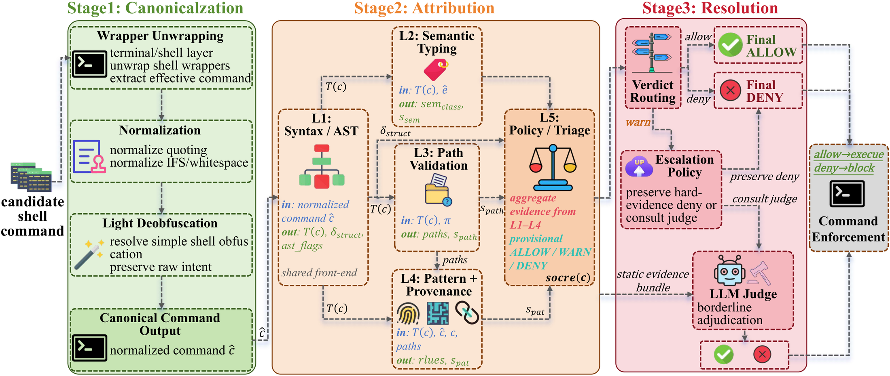

<p align="center">
  
</p>

<h1 align="center">CARE: Pre-Execution Command Verification<br>for Shell-Executing LLM Agents</h1>

<p align="center">
  <b>C</b>anonicalization · <b>A</b>ttribution · <b>R</b>esolution <b>E</b>ngine<br>
  A shell-specific, static-first pre-execution verifier for shell-executing LLM agents.
</p>

<p align="center">
  <a href="https://prisma-research.github.io/CARE/"></a>
  <a href="https://prisma-research.github.io/CARE/"></a>
  <a href="https://github.com/prisma-research/CARE"></a>
  <a href="#install"></a>
  <a href="LICENSE"></a>
  <a href="#citation"></a>
</p>

<p align="center">
  <i>Fast like a rule engine. Careful like a judge.</i><br>
  <b>85.64 % F1 · 0.91 % FPR · 2.32 ms mean latency</b><br>
  Only ~4 % of commands ever reach the LLM.
</p>

---

## 📢 News

- **[2026-06-16]** 🎉 Our paper *"CARE: Pre-Execution Command Verification for Shell-Executing LLM Agents"* has been **accepted at the IEEE International Symposium on Software Reliability Engineering (ISSRE 2026)**!
- **[2026-06-16]** 🚀 The [project page](https://prisma-research.github.io/CARE/) is live.

---

## 🎯 Overview

CARE mediates a candidate shell command *before* it reaches the host shell.
It canonicalizes the command into a stable verification target, derives
deterministic multi-view evidence over syntax, command semantics, path
context, and provenance-backed risk patterns, and escalates only
underdetermined **WARN** cases to an LLM judge. The common case stays fast,
reproducible, and auditable; neural adjudication is reserved for borderline
commands.

<p align="center">
  <a href="docs/assets/overview.png"></a>
</p>

This repository contains the reference implementation of the CARE pipeline as
described in the paper *"CARE: Pre-Execution Command Verification for
Shell-Executing LLM Agents"* (ISSRE 2026). It ships **only the CARE method** —
no baselines and no experiment harness.

### Results at a glance (main split, 549 commands, 12 baselines)

| Guard | F1 % ↑ | DR % ↑ | FPR % ↓ | Latency ↓ |
|---|---:|---:|---:|---:|
| Best static baseline (OpenClaw4Layer) | 72.62 | 57.27 | 0.30 | 0.02 ms |
| Best LLM judge (LLMJudge) | 73.09 | 67.27 | 11.25 | 45.9 ms |
| **CARE (w/o Resolution)** — static only | **84.99** | **75.91** | **1.82** | **0.34 ms** |
| **CARE** — full pipeline | **85.64** | **75.91** | **0.91** | **2.32 ms** |

Benign utility is essentially untouched (57.00 % NL2SH resolve rate vs 57.33 %
unguarded; 1 deny in 300 tasks), and on 600 Docker-executed, LLM-generated
attack commands the static profile cuts realised harm from 74.8 % to **37.3 %**.

---

## ⚙️ Pipeline

CARE is a three-stage pipeline (paper Sec. III, Algorithm 1):

```
                 raw command c
                      │
   Stage 1  ┌─────────▼──────────┐
 Canonical- │   N(c) -> ĉ        │  wrapper unwrap, IFS/var expand,
 ization    │                    │  base64/printf decode, shell -c unwrap
            └─────────┬──────────┘
                      │ ĉ
   Stage 2  ┌─────────▼──────────┐
 Attribution│ L1 Structure  δ_str│  Eq. 1
            │ L2 Semantic   s_sem│  Eq. 2
            │ L3 Path       s_pth│  Eq. 3–4
            │ L4 Pattern    s_pat│  Eq. 5   (139 provenance-tagged rules)
            │ L5 Policy → score, │  Eq. 6–7
            │          d_prov     │
            └─────────┬──────────┘
                      │ d_prov ∈ {ALLOW, WARN, DENY}
   Stage 3  ┌─────────▼──────────┐
 Resolution │ ALLOW / DENY: final│
            │ WARN: skip(c)?     │  Eq. 8–11
            │   yes → DENY       │  (no LLM call)
            │   no  → LLM judge  │  SAFE / DANGEROUS
            └─────────┬──────────┘
                      ▼  final decision d*
```

**Composite score (Eq. 6):**

```
score(c) = w_sem·s_sem + w_path·s_path + w_pat·s_pat + w_struct·δ_struct
```

with the default balanced weights `w_sem = w_path = w_pat = 0.30`,
`w_struct = 0.10`.

**Provisional triage (Eq. 7):**

```
d_prov = ALLOW  if score < τ_low
         WARN   if τ_low ≤ score < τ_high
         DENY   if score ≥ τ_high
```

with balanced thresholds `τ_low = 0.15`, `τ_high = 0.35`.

**Skip predicates (Eq. 8):** a WARN command retains its static DENY and
bypasses the LLM when any of

```
p_rule (Eq. 9)  : a fired L4 rule has MITRE provenance and confidence ≥ θ_rule (0.80)
p_sem  (Eq. 10) : an L2 atom is in a high-risk class with score ≥ θ_sem (0.70)
p_spath(Eq. 11) : the L3 path layer fires (sensitive-location access)
```

holds. Otherwise the command and its evidence trace go to a single
safety-biased LLM judge that returns SAFE/DANGEROUS; any judge error
fails closed to DENY.

---

## 💻 Repository layout and paper mapping

| File | Paper concept |
|------|---------------|
| `care/engine.py` — `CAREEngine` | Stages 1–2 orchestrator (Algorithm 1) |
| `care/canonicalization.py` | Stage 1 — canonicalization operator `N` |
| `care/structure.py` | L1 — syntax/structural analysis (`δ_struct`, Eq. 1) |
| `care/semantic.py` | L2 — semantic attribution (`s_sem`, Eq. 2) |
| `care/path.py` | L3 — path-sensitive attribution (`s_path`, Eq. 3–4) |
| `care/pattern.py` | L4 — pattern & provenance attribution (`s_pat`, Eq. 5) |
| `care/policy.py` | L5 — weighted aggregation + triage (Eq. 6–7) |
| `care/modes.py` | L5 — strict/balanced/auto operating modes (Appendix A.5) |
| `care/resolution.py` — `CARE` | Stage 3 — skip predicates + LLM judge (Eq. 8–11) |
| `care/common.py` | shared types + L2 base-score table |
| `care/rules/rule_provenance.json` | 139-rule bank artifact (Appendix A.4) |

---

<a id="install"></a>

## 📦 Install

```bash
git clone https://github.com/prisma-research/CARE.git
cd CARE
pip install -e .            # installs bashlex; add [resolution] for the LLM judge
# or, minimally:
pip install bashlex         # openai only needed for Stage 3
```

Python ≥ 3.9. `bashlex` is the only core dependency; if it is unavailable the
L1 layer degrades to a regex fallback.

---

## 🚀 Usage

### Static engine (deterministic, no network)

```python
from care import CAREEngine

eng = CAREEngine()
r = eng.analyze("rm -rf /var/log/*")
print(r.decision, r.score)          # DENY 0.765
print(r.triggered_layers)           # ['L2_Semantic', 'L3_Path', 'L4_Pattern']
print(r.fired_rules[0]['rule_id'])  # e.g. SE-P-042
```

`analyze()` returns an `AnalysisResult` with the full evidence trace
(`details['scoring']`, per-layer scores, fired rules) so every decision is
auditable.

### Full pipeline with Resolution (Stage 3)

Stage 3 calls an OpenAI-compatible LLM endpoint on WARN commands that no skip
predicate resolves. Point CARE at your server via environment variables:

```bash
export CARE_LLM_BASE_URL=http://127.0.0.1:8006/v1
export CARE_LLM_MODEL=Qwen3-Coder-30B-A3B-Instruct
export CARE_LLM_API_KEY=not-needed-local-vllm
```

```python
from care import CARE

guard = CARE()                       # use_judge=True by default
print(guard.is_dangerous("rsync -avz ./data user@host:/backup/"))
```

The reported results use `Qwen3-Coder-30B-A3B-Instruct` served by vLLM,
`temperature=0`, `max_tokens=8`, single-shot.

### Static-only configuration — *CARE (w/o Resolution)*

```python
from care import CARE
guard = CARE(use_judge=False)        # WARN and DENY both enforced as blocked
```

### Operating modes

```python
from care import CAREEngine
strict   = CAREEngine(mode="strict")    # τ_low=0.10, τ_high=0.20
balanced = CAREEngine(mode="balanced")  # τ_low=0.15, τ_high=0.35  (default)
auto     = CAREEngine(mode="auto")      # τ_low=0.20, τ_high=0.50
```

---

## 🛡️ Rule bank

`care/rules/rule_provenance.json` contains the **139** provenance-tagged rules
used by L4, split by provenance tier (Sec. IV, Appendix A.4):

| Tier | Count | Weight `π` |
|------|-------|-----------|
| MITRE ATT&CK | 92 | 1.00 |
| GTFOBins | 31 | 0.85 |
| Manual Cases | 16 | 0.60 |
| **Total** | **139** | |

Each rule's effective contribution is `π(tier) · conf(rule)`; L4 reports the
maximum over all fired rules. The JSON artifact is regenerated from the
in-code rule specification with `python -m care.pattern`.

---

## 🧪 Reproducing the case studies

```bash
python examples/quickstart.py
python tests/test_pipeline.py      # or: python -m pytest tests/
```

The tests assert the paper's constants (139 = 92/31/16 rules; weights
0.3/0.3/0.3/0.1; τ_low/τ_high; aggregation formula) and the three-way triage
on representative commands.

---

## 📌 Scope

CARE is a **single-command, pre-execution** verifier operating on the command
string plus bounded path context. It does not observe agent prompts,
reasoning, or conversation history, and is a complement to — not a replacement
for — sandboxing and host hardening. Session-level and trajectory-level
hazards are out of scope.

<a id="citation"></a>

## 📝 Citation

If you use CARE, please cite our ISSRE 2026 paper:

```bibtex
@article{liu2026care,
  title   = {CARE: Pre-Execution Command Verification for Shell-Executing LLM Agents},
  author  = {Liu, Yu and Zhang, Wenxiao and Yang, Zhiwei and Zhang, Zhongyi and Feng, Hanqi and Wang, Xinyu and Qiu, Peng and Liu, Yanbing and Poczos, Barnabas and Hong, Jin B.},
  journal = {arXiv preprint arXiv:2607.21642},
  year    = {2026}
}
```

## 📄 License

MIT — see [LICENSE](LICENSE).
